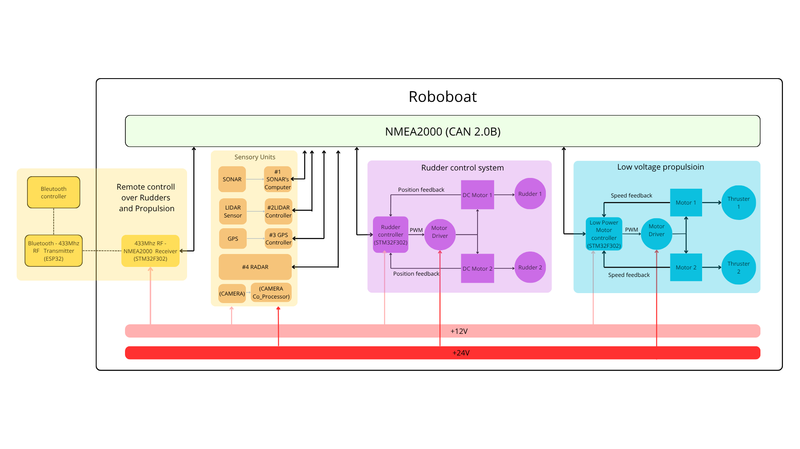
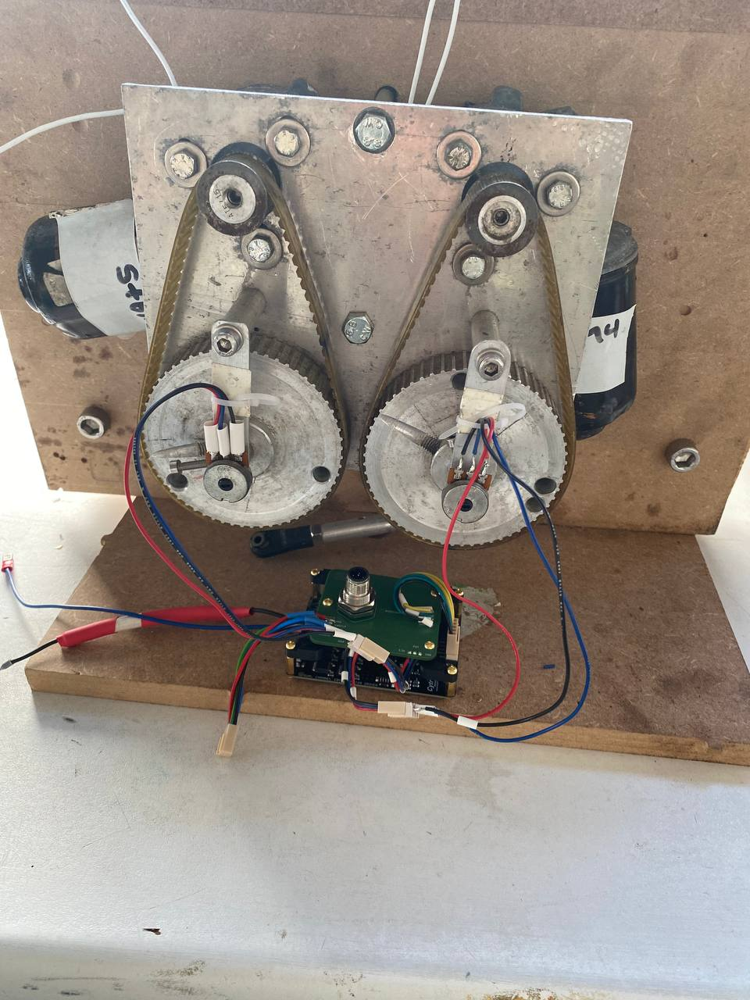
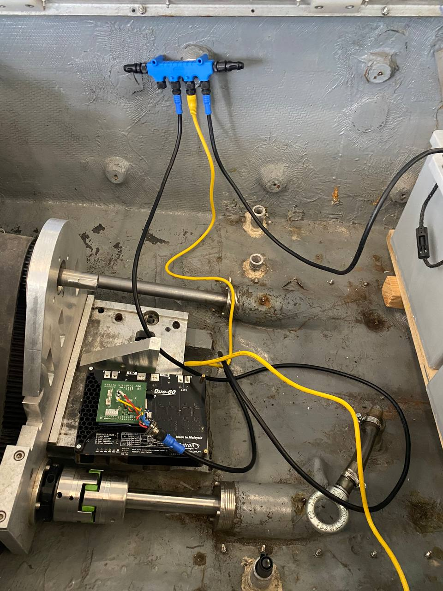
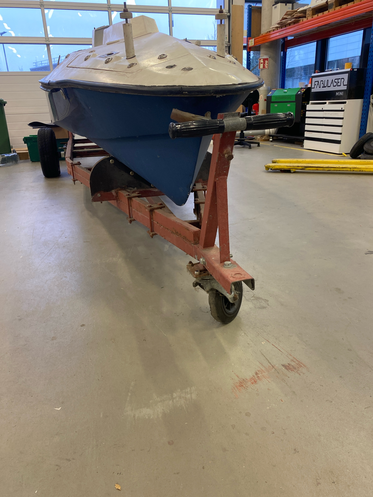

> ## Boat Automation Project

## Introduction
This is the first iteration of automating the boat owned by FabLab in Building 9. The lab inherited the boat itself, a Radar Marine system, a propulsion assembly with both high- and low-voltage motors, and several other devices scattered around the lab. These include a NASA compass, transducers, an IMU, and more.

## Current Result
A universal controller was successfully developed, capable of managing multiple modules with only minor software modifications. Through several design iterations, the requirements for both hardware and software in maritime applications became clear. As a result, the low-level architecture was established, defining the necessary set of components for building and integrating each device into a network of devices.
With the first fully functional module completed, future development of the Roboboat is expected to progress more efficiently. The experience gained so far provides a strong foundation, enabling faster and more effective work in the next stages of the project.

## Low-Voltage Motor Unit  
**Objective:** Design a water-protected enclosure for the motor controller and driver, suitable for installation inside the boat.

---

## Rudder Unit  
**Objective:** Design a water-protected enclosure for the rudder controller and driver, suitable for mounting inside the boat.  

---

## NMEA2000 Backbone Attachment  
**Objective:** Create a secure housing for the NMEA2000 backbone to be mounted inside the hull.

---

## Wireless Communication Unit  
**Objective:** Develop transmitting and receiving units to enable remote control of the boat.

**How to Achieve It:**  
- Design a PCB using an **ESP32** and **HC-12** module on the transmitter side.  
  Create a simple script to transmit four analog variables. Input values are defined by a Bluetooth game controller.  
- Design a PCB using an **STM32F302RB** microcontroller and **HC-12** module on the receiver side.  
  Incoming data should be converted into the **NMEA2000** protocol.

---

## Hull Sanding  
**Objective:** After a test launch, leakage was detected. The hull needs to be sanded and patched to eliminate this defect.

